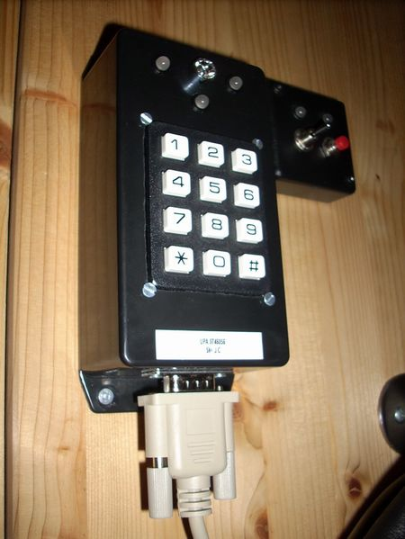

## Source code for project: [Programmable keypad with two modes](https://link.stdout.no/Y)

Keypad with programmable PIN code, two outputs (modes) and protection against repeated incorrect PINs. Uses an AVR ATtiny2313 microcontroller.

Written in basic, using [Bascom-AVR](http://www.mcselec.com/).

### Author
[Thomas Jensen](https://thomas.stdout.no)
